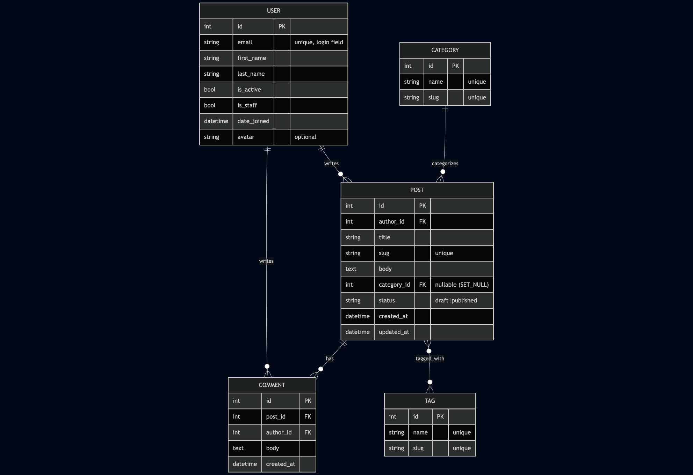

# Blog API

## Project structure
- apps/ - Django apps
- settings/ - project settings + package
- requirements/ - split dependencies
- logs/ - logs
- docs/erd.png - ERD diagram

## ERD


## Quick Start
``` bash 
docker compose ip --build -d

curl -I http://localhost/admin/login/
# Response: 200 OK, Server: nginx/1.27...

curl -I http://localhost/static/admin/css/base.css
# Response: 200 OK, Cache-Control: max-age=2592000

curl http://localhost/api/posts/
# Response: JSON list

docker compose stop web
curl -I http://localhost/api/posts/
# Response: 502 Bad Gateway
docker compose start web

curl http://localhost:8000/
# Response: connection refused

wscat -c "ws://localhost/ws/posts/<existing-slug>/comments/?token=<jwt>"
# Response: Connected